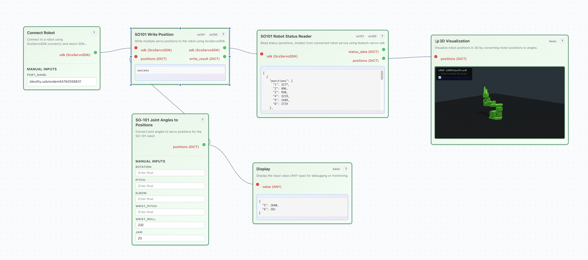

# Factory UI

A powerful GUI for open-source robotics. Offers modular, reusable building blocks—like Lego—for constructing custom robot agent workflows.



## 📋 Prerequisites

Before you begin, assemble and set up your robot by following the instructions at [https://bambot.org/](https://bambot.org/). Find the serial port that's connected to your robot.


## 🚀 Quick Start

### 1. Setup
```bash
git clone <repository-url>
cd FactoryUI
./setup.sh
```

### 2. Start Backend
```bash
cd backend
source venv/bin/activate
python -m uvicorn app.main:app --reload
```

### 3. Start Frontend (New Terminal)
```bash
cd factory-ui
npm start
```

### 4. Open Application
Visit [http://localhost:3000](http://localhost:3000)

## 📚 Documentation

### How to create custom nodes to extend your workflow
- [Custom Nodes Guide](backend/custom_nodes/README.md) - Create your own workflow nodes


## 📄 License

MIT
